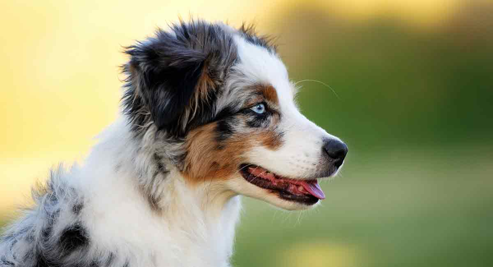

``` {r setup, echo = FALSE}
knitr::opts_chunk$set(
  collapse = TRUE,
  warning = FALSE,
  message = FALSE,
  echo = FALSE,
  comment = "#>",
  fig.path = "../figures")
knitr::read_chunk("src/my-external-code.R")
```

# Importing some data

```{r import-data, cache = TRUE, cache.extra=tools::md5sum('weekdays.csv')}
d <- read.csv('weekdays.csv')

```

``` {r-long-running-code, cache=TRUE}
results <- data.frame(d)
```

```{r dependson="long-running-code", cache=TRUE}
print(results)
```

# Running a bit of external code cvf

```{r set-up-the-data, eval = FALSE}

```

```{r set-up-and-print-the-data, echo = FALSE}
<<set-up-the-data>>
<<print-the-data>>

```

```{r plot-the-data, echo = FALSE}

```

# Playing with tidyverse in Markdown

Here is some inline code `r 1 + 1`

```{r, starwars-plot, fig.cap = "A ggplots of starwars stuff"}
library(tidyverse)

starwars %>% filter(species == "Human") %>% ggplot() + aes(x = height, y = mass) + geom_point()

```

```{r starwars-tbl}

starwars %>% filter(species == "Human") %>% 
  select(name,
         height,
         mass,
         homeworld) %>%
  knitr::kable(caption = "A knitr kable table of starwars data"
  )

```

```{r, dog-fig, fig.cap = "My non-code figure of a dog"}



```


# References

Reference 1: [Website on Australia Shepherds](https://thehappypuppysite.com/mini-australian-shepherd/)

---
references:
- id: fenner2012a
  title: One-click science marketing
  author:
  - family: Fenner
    given: Martin
  container-title: Nature Materials
  volume: 11
  URL: 'http://dx.doi.org/10.1038/nmat3283'
  DOI: 10.1038/nmat3283
  issue: 4
  publisher: Nature Publishing Group
  page: 261-263
  type: article-journal
  issued:
    year: 2012
    month: 3
---
